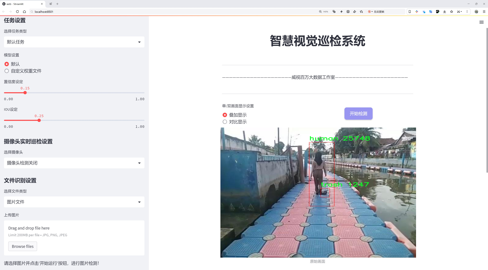
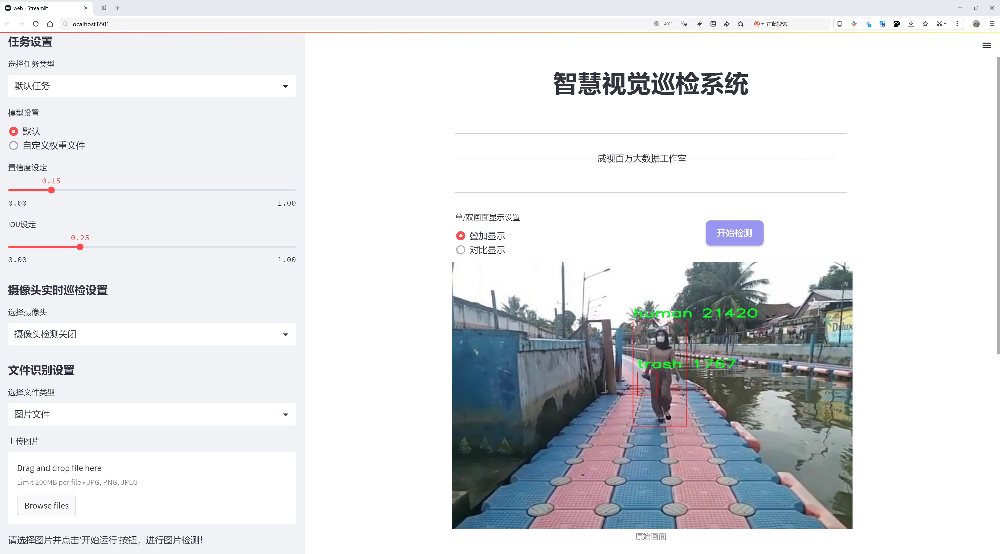
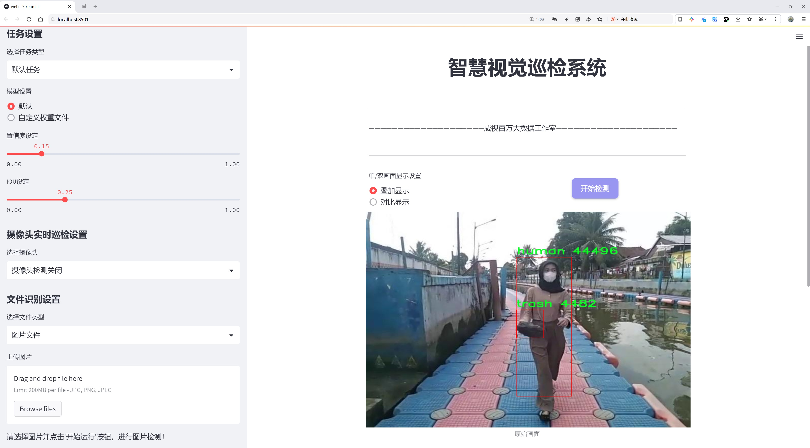
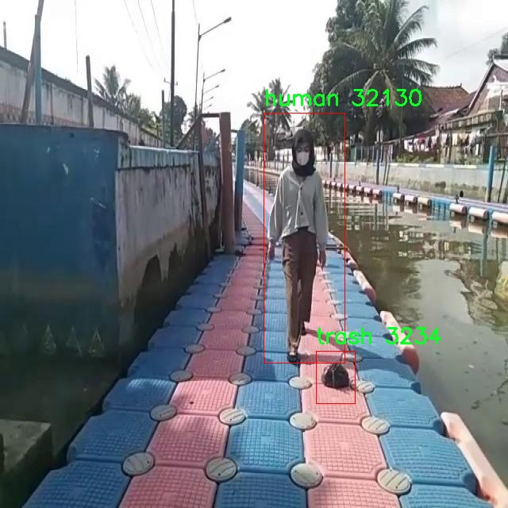
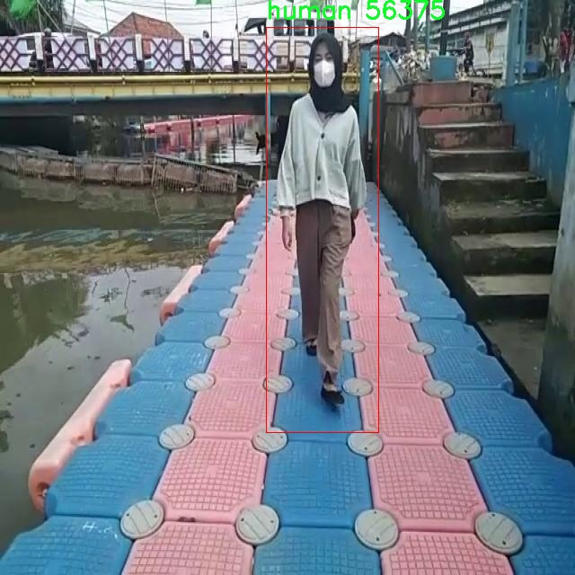
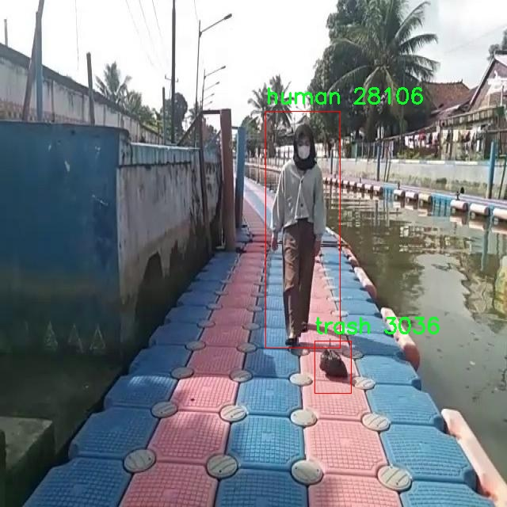
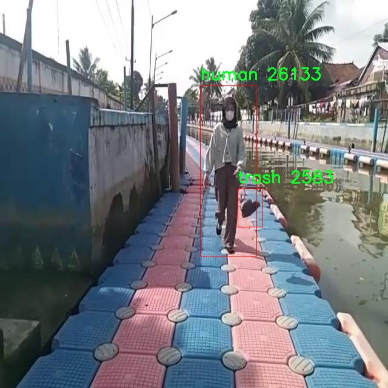
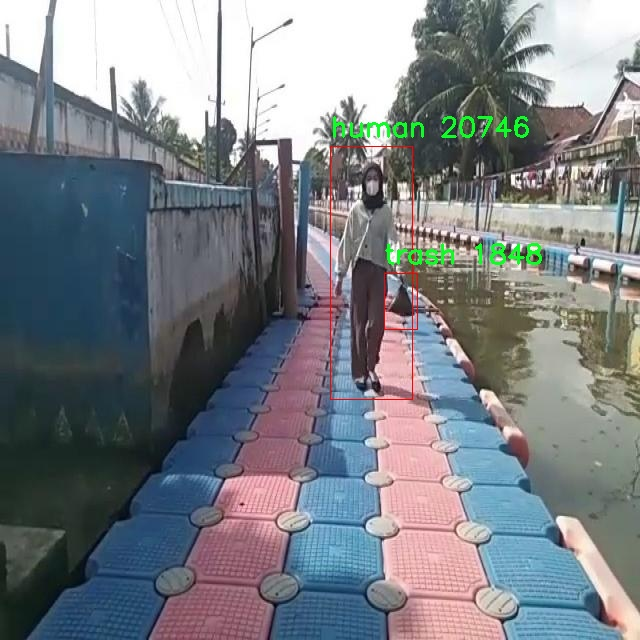

# 人类与垃圾检测检测系统源码分享
 # [一条龙教学YOLOV8标注好的数据集一键训练_70+全套改进创新点发刊_Web前端展示]

### 1.研究背景与意义

项目参考[AAAI Association for the Advancement of Artificial Intelligence](https://gitee.com/qunmasj/projects)

项目来源[AACV Association for the Advancement of Computer Vision](https://github.com/qunshansj/good)

研究背景与意义

随着城市化进程的加快，城市垃圾问题日益严重，成为影响城市环境与居民生活质量的重要因素。垃圾的随意堆放不仅影响城市的美观，还可能引发一系列环境问题，如水土污染、空气污染及生态失衡等。因此，建立有效的垃圾管理系统显得尤为重要。在此背景下，智能化的垃圾检测与分类系统应运而生，成为解决城市垃圾问题的重要手段之一。近年来，计算机视觉技术的快速发展为垃圾检测提供了新的解决方案，尤其是基于深度学习的目标检测算法，如YOLO（You Only Look Once）系列，因其高效性和准确性，广泛应用于各类物体检测任务中。

YOLOv8作为YOLO系列的最新版本，具备了更高的检测精度和更快的处理速度，适合于实时应用场景。通过对YOLOv8的改进，可以进一步提升其在复杂环境下的检测能力，尤其是在不同光照、天气和背景条件下的人类与垃圾的识别。这对于构建一个高效的垃圾监测系统具有重要的现实意义。该系统不仅能够实时监测城市中的垃圾情况，还能通过识别与分类，帮助相关部门及时采取措施，减少垃圾对环境的影响。

本研究所使用的数据集包含3000张图像，涵盖了两类目标：人类与垃圾。这一数据集的构建为模型的训练与评估提供了坚实的基础。通过对这些图像的分析，研究者可以提取出人类与垃圾的特征，进而训练出一个能够在多种场景下有效识别这两类目标的模型。值得注意的是，数据集的多样性和丰富性将直接影响模型的泛化能力，因此，在数据预处理和增强方面的工作也显得尤为重要。

此外，本研究的意义还在于推动智能垃圾管理系统的普及与应用。通过将改进后的YOLOv8模型应用于实际场景，可以实现对垃圾的自动监测与分类，从而提高垃圾管理的效率和准确性。这不仅有助于提升城市环境卫生水平，也为相关部门提供了科学的数据支持，促进政策的制定与实施。

综上所述，基于改进YOLOv8的人类与垃圾检测系统的研究，不仅具有重要的理论价值，还具备广泛的应用前景。通过深入探索目标检测技术在垃圾管理中的应用，能够为城市可持续发展提供新的思路与方法，为实现更为智能化的城市管理奠定基础。这一研究将为未来的环境保护和城市治理提供重要的技术支持，推动社会的可持续发展。

### 2.图片演示







##### 注意：由于此博客编辑较早，上面“2.图片演示”和“3.视频演示”展示的系统图片或者视频可能为老版本，新版本在老版本的基础上升级如下：（实际效果以升级的新版本为准）

  （1）适配了YOLOV8的“目标检测”模型和“实例分割”模型，通过加载相应的权重（.pt）文件即可自适应加载模型。

  （2）支持“图片识别”、“视频识别”、“摄像头实时识别”三种识别模式。

  （3）支持“图片识别”、“视频识别”、“摄像头实时识别”三种识别结果保存导出，解决手动导出（容易卡顿出现爆内存）存在的问题，识别完自动保存结果并导出到tempDir中。

  （4）支持Web前端系统中的标题、背景图等自定义修改，后面提供修改教程。

  另外本项目提供训练的数据集和训练教程,暂不提供权重文件（best.pt）,需要您按照教程进行训练后实现图片演示和Web前端界面演示的效果。

### 3.视频演示

[3.1 视频演示](https://www.bilibili.com/video/BV11UsTeSEM4/?vd_source=ff015de2d29cbe2a9cdbfa7064407a08)

### 4.数据集信息展示

数据集信息展示

在当今社会，随着城市化进程的加快，垃圾管理与人类活动的监测变得愈发重要。为了有效地提升垃圾检测与人类识别的精度，特别是在复杂环境中的应用，研究人员开发了一个专门的数据集，旨在为改进YOLOv8模型提供强有力的支持。该数据集包含3000幅图像，涵盖了两大类目标：人类与垃圾。这一数据集的设计考虑到了现实世界中人类与垃圾的多样性与复杂性，确保了模型在训练过程中能够接触到丰富的场景与样本。

数据集中包含的图像经过精心挑选，涵盖了各种环境下的人类活动与垃圾分布。这些图像不仅包括城市街道、公园、商业区等公共场所，还涉及到不同的天气条件与光照变化，从而增强了模型的鲁棒性与适应性。每幅图像都经过标注，确保模型在训练时能够准确识别出人类与垃圾的边界。这种高质量的标注是实现高效目标检测的基础，确保了模型在实际应用中的可靠性。

在类别方面，数据集明确划分为两类：人类与垃圾。人类类的样本涵盖了不同性别、年龄和活动状态的人群，确保了模型能够在多样化的人群中进行有效识别。而垃圾类则包括了各种类型的垃圾，如塑料瓶、纸张、食品包装等，反映了现实生活中常见的垃圾种类。这种分类的多样性不仅有助于提高模型的检测精度，也为后续的垃圾分类与管理提供了基础数据支持。

此外，该数据集的使用许可证为公共领域，意味着研究人员和开发者可以自由地使用、修改和分发这些数据。这一开放性为学术界和工业界的合作提供了便利，鼓励更多的研究者参与到人类与垃圾检测系统的改进中来。通过共享数据集，研究人员能够在已有的基础上进行创新，推动目标检测技术的进步。

在技术层面，YOLOv8作为一种先进的目标检测模型，具备了高效的实时检测能力。通过使用该数据集进行训练，研究人员可以进一步优化YOLOv8的性能，使其在复杂场景下的检测准确率和速度得到提升。数据集中的多样化样本将帮助模型学习到更为丰富的特征，从而在实际应用中实现更高的识别率和更低的误报率。

总之，这一数据集为改进YOLOv8的人类与垃圾检测系统提供了坚实的基础，涵盖了丰富的图像样本与明确的类别划分。通过充分利用这一数据集，研究人员能够在目标检测领域取得更大的突破，为未来的智能城市建设与环境保护贡献力量。











### 5.全套项目环境部署视频教程（零基础手把手教学）

[5.1 环境部署教程链接（零基础手把手教学）](https://www.ixigua.com/7404473917358506534?logTag=c807d0cbc21c0ef59de5)


[5.2 安装Python虚拟环境创建和依赖库安装视频教程链接（零基础手把手教学）](https://www.ixigua.com/7404474678003106304?logTag=1f1041108cd1f708b01a)

### 6.手把手YOLOV8训练视频教程（零基础小白有手就能学会）

[6.1 环境部署教程链接（零基础手把手教学）](https://www.ixigua.com/7404477157818401292?logTag=d31a2dfd1983c9668658)

### 7.70+种全套YOLOV8创新点代码加载调参视频教程（一键加载写好的改进模型的配置文件）

[7.1 环境部署教程链接（零基础手把手教学）](https://www.ixigua.com/7404478314661806627?logTag=29066f8288e3f4eea3a4)

### 8.70+种全套YOLOV8创新点原理讲解（非科班也可以轻松写刊发刊，V10版本正在科研待更新）

由于篇幅限制，每个创新点的具体原理讲解就不一一展开，具体见下列网址中的创新点对应子项目的技术原理博客网址【Blog】：


[8.1 70+种全套YOLOV8创新点原理讲解链接](https://gitee.com/qunmasj/good)

### 9.系统功能展示（检测对象为举例，实际内容以本项目数据集为准）

图9.1.系统支持检测结果表格显示

  图9.2.系统支持置信度和IOU阈值手动调节

  图9.3.系统支持自定义加载权重文件best.pt(需要你通过步骤5中训练获得)

  图9.4.系统支持摄像头实时识别

  图9.5.系统支持图片识别

  图9.6.系统支持视频识别

  图9.7.系统支持识别结果文件自动保存

  图9.8.系统支持Excel导出检测结果数据


### 10.原始YOLOV8算法原理

原始YOLOv8算法原理

YOLOv8是YOLO系列中最新的目标检测算法，其设计理念在于兼顾检测精度与实时性，以适应日益增长的实际应用需求。相较于前代的YOLOv5，YOLOv8在多个方面进行了显著的改进，使其在目标检测领域展现出更为优越的性能。YOLOv8根据不同的应用场景和需求，提供了n、s、m、l、x五种不同的模型版本，网络深度和检测精度随之递增，其中YOLOv8n以其较小的参数量和快速的检测速度，成为了轻量化应用的首选。

YOLOv8的网络结构可以分为四个主要部分：输入端、骨干网络、颈部网络和头部网络。输入端的设计采用了马赛克数据增强、自适应锚框计算和自适应灰度填充等技术，以提升模型的鲁棒性和泛化能力。马赛克数据增强在训练初期有效地增加了样本的多样性，但在训练的最后阶段，YOLOv8选择停止使用此技术，以避免对数据真实分布的破坏，从而确保模型学习到的特征更为可靠。

在骨干网络部分，YOLOv8引入了C2f模块和SPPF（Spatial Pyramid Pooling Fusion）结构。C2f模块是YOLOv8的核心特征提取单元，其设计灵感来源于YOLOv7的ELAN结构。通过增加分支和跨层连接，C2f模块显著增强了模型的梯度流动性，使得特征学习更加高效。此外，SPPF模块的保留则在不增加计算负担的前提下，继续提升了特征提取的效果。整体而言，骨干网络的设计旨在提升特征表示能力，使得YOLOv8在复杂场景下的目标检测表现更为出色。

颈部网络采用了路径聚合网络（PAN）结构，旨在增强不同尺度特征的融合能力。PAN通过高效的特征融合策略，使得模型能够更好地处理不同大小的目标，从而提高检测的准确性。这一设计使得YOLOv8在多尺度目标检测中表现得尤为突出，能够在复杂的场景中有效识别和定位目标。

头部网络是YOLOv8的重要组成部分，其主要任务是解耦分类和检测过程。YOLOv8采用了与YOLOX类似的解耦头结构，将分类和定位任务分为两个并行的分支。这种设计使得模型在处理分类和定位时能够更加专注于各自的任务，提高了收敛速度和预测精度。分类分支使用二元交叉熵损失（BCELoss）进行训练，而回归分支则结合了分布焦点损失（DFLoss）和完全交并比损失（CIOULoss），以提升边界框预测的准确性。此外，YOLOv8还引入了无锚框检测机制，直接预测目标的中心位置，减少了锚框预测的复杂性，从而加速了非最大抑制（NMS）过程。

在整体性能上，YOLOv8在COCO数据集上的表现相较于其他YOLO系列模型有了显著提升。通过对比不同模型尺寸的mAP（mean Average Precision）和推理延迟，YOLOv8展现出在保持较小模型参数的同时，依然能够实现更高的检测精度和更快的推理速度。这一特性使得YOLOv8在实时目标检测任务中具备了更强的竞争力，尤其适用于需要快速响应的应用场景，如自动驾驶、安防监控和机器人视觉等。

综上所述，YOLOv8的设计理念和技术创新使其在目标检测领域树立了新的标杆。通过优化网络结构、增强特征提取能力和提高模型的实时性，YOLOv8不仅继承了YOLO系列的优良传统，更在实际应用中展现出强大的生命力和广泛的适用性。未来，随着技术的不断进步和应用场景的多样化，YOLOv8无疑将在目标检测领域继续发挥重要作用，推动相关研究和应用的发展。


### 11.项目核心源码讲解（再也不用担心看不懂代码逻辑）

#### 11.1 ultralytics\data\explorer\utils.py

以下是经过精简和注释的核心代码部分：

```python
# 导入必要的库
import getpass
from typing import List
import cv2
import numpy as np
import pandas as pd
from ultralytics.data.augment import LetterBox
from ultralytics.utils import LOGGER as logger
from ultralytics.utils import SETTINGS
from ultralytics.utils.checks import check_requirements
from ultralytics.utils.ops import xyxy2xywh
from ultralytics.utils.plotting import plot_images

def get_table_schema(vector_size):
    """返回数据库表的模式定义，包含图像文件、标签、类别、边界框、掩码、关键点和向量。"""
    from lancedb.pydantic import LanceModel, Vector

    class Schema(LanceModel):
        im_file: str  # 图像文件名
        labels: List[str]  # 标签列表
        cls: List[int]  # 类别索引列表
        bboxes: List[List[float]]  # 边界框列表
        masks: List[List[List[int]]]  # 掩码列表
        keypoints: List[List[List[float]]]  # 关键点列表
        vector: Vector(vector_size)  # 向量，大小为vector_size

    return Schema

def sanitize_batch(batch, dataset_info):
    """清理输入批次以确保格式和维度正确。"""
    # 将类别展平并转换为列表
    batch["cls"] = batch["cls"].flatten().int().tolist()
    
    # 根据类别对边界框和类别进行排序
    box_cls_pair = sorted(zip(batch["bboxes"].tolist(), batch["cls"]), key=lambda x: x[1])
    batch["bboxes"] = [box for box, _ in box_cls_pair]
    batch["cls"] = [cls for _, cls in box_cls_pair]
    
    # 获取标签
    batch["labels"] = [dataset_info["names"][i] for i in batch["cls"]]
    
    # 处理掩码和关键点
    batch["masks"] = batch["masks"].tolist() if "masks" in batch else [[[]]]
    batch["keypoints"] = batch["keypoints"].tolist() if "keypoints" in batch else [[[]]]
    
    return batch

def plot_query_result(similar_set, plot_labels=True):
    """
    绘制来自相似数据集的图像。

    参数:
        similar_set (list): 包含相似数据点的Pyarrow或pandas对象
        plot_labels (bool): 是否绘制标签
    """
    # 将数据集转换为字典格式
    similar_set = (
        similar_set.to_dict(orient="list") if isinstance(similar_set, pd.DataFrame) else similar_set.to_pydict()
    )
    
    # 初始化变量
    images = similar_set.get("im_file", [])
    bboxes = similar_set.get("bboxes", [[]])
    masks = similar_set.get("masks", [[[]]])
    kpts = similar_set.get("keypoints", [[[]]])
    cls = similar_set.get("cls", [])
    
    plot_size = 640  # 绘图大小
    imgs, plot_boxes, plot_masks, plot_kpts = [], [], [], []
    
    for i, imf in enumerate(images):
        im = cv2.imread(imf)  # 读取图像
        im = cv2.cvtColor(im, cv2.COLOR_BGR2RGB)  # 转换颜色空间
        h, w = im.shape[:2]
        r = min(plot_size / h, plot_size / w)  # 计算缩放比例
        
        # 调整图像大小
        imgs.append(LetterBox(plot_size, center=False)(image=im).transpose(2, 0, 1))
        
        if plot_labels:
            # 处理边界框
            if len(bboxes) > i and len(bboxes[i]) > 0:
                box = np.array(bboxes[i], dtype=np.float32)
                box[:, [0, 2]] *= r  # 缩放边界框
                box[:, [1, 3]] *= r
                plot_boxes.append(box)
                
            # 处理掩码
            if len(masks) > i and len(masks[i]) > 0:
                mask = np.array(masks[i], dtype=np.uint8)[0]
                plot_masks.append(LetterBox(plot_size, center=False)(image=mask))
                
            # 处理关键点
            if len(kpts) > i and kpts[i] is not None:
                kpt = np.array(kpts[i], dtype=np.float32)
                kpt[:, :, :2] *= r
                plot_kpts.append(kpt)

    # 将图像和数据堆叠成数组
    imgs = np.stack(imgs, axis=0)
    masks = np.stack(plot_masks, axis=0) if plot_masks else np.zeros(0, dtype=np.uint8)
    kpts = np.concatenate(plot_kpts, axis=0) if plot_kpts else np.zeros((0, 51), dtype=np.float32)
    boxes = xyxy2xywh(np.concatenate(plot_boxes, axis=0)) if plot_boxes else np.zeros(0, dtype=np.float32)
    
    # 绘制图像
    return plot_images(
        imgs, 
        cls=np.concatenate([np.array(c, dtype=np.int32) for c in cls], axis=0), 
        bboxes=boxes, 
        masks=masks, 
        kpts=kpts, 
        max_subplots=len(images), 
        save=False, 
        threaded=False
    )

def prompt_sql_query(query):
    """根据用户请求生成SQL查询。"""
    check_requirements("openai>=1.6.1")
    from openai import OpenAI

    # 检查API密钥
    if not SETTINGS["openai_api_key"]:
        logger.warning("未找到OpenAI API密钥，请输入您的API密钥。")
        openai_api_key = getpass.getpass("OpenAI API密钥: ")
        SETTINGS.update({"openai_api_key": openai_api_key})
    
    openai = OpenAI(api_key=SETTINGS["openai_api_key"])

    # 构建消息以发送给OpenAI
    messages = [
        {
            "role": "system",
            "content": """
                你是一个精通SQL的数据科学家。请根据以下模式和用户请求输出一个SQL查询。
                只需输出格式，固定选择语句，从'table'中选择所有内容，如`SELECT * from 'table'`
                ...
             """,
        },
        {"role": "user", "content": f"{query}"},
    ]

    # 发送请求并返回结果
    response = openai.chat.completions.create(model="gpt-3.5-turbo", messages=messages)
    return response.choices[0].message.content
```

### 代码说明：
1. **导入模块**：导入所需的库和模块，包括数据处理、图像处理和深度学习相关的工具。
2. **`get_table_schema`函数**：定义数据库表的模式，包括图像文件、标签、类别、边界框、掩码、关键点和向量。
3. **`sanitize_batch`函数**：清理输入数据批次，确保数据格式和维度正确，主要用于模型推理前的数据准备。
4. **`plot_query_result`函数**：根据相似数据集绘制图像，支持绘制边界框、掩码和关键点。
5. **`prompt_sql_query`函数**：生成SQL查询，使用OpenAI的API，根据用户的请求和给定的模式返回SQL查询字符串。

这个文件是Ultralytics YOLO项目中的一个工具模块，主要用于处理与数据相关的操作，包括数据库模式定义、数据预处理、图像绘制以及与OpenAI API的交互。

首先，文件导入了一些必要的库，包括用于图像处理的OpenCV、用于数据处理的NumPy和Pandas，以及Ultralytics特定的模块和工具。接着，定义了几个函数。

`get_table_schema`函数用于提取和返回数据库表的模式。它定义了一个名为`Schema`的类，包含了图像文件名、标签、类别、边界框、掩膜、关键点和向量等字段。这些字段的类型和结构为后续的数据存储和查询提供了基础。

`get_sim_index_schema`函数则返回一个数据库表的模式，专注于相似性索引的结构，包括索引、图像文件名、计数和相似图像文件列表。

`sanitize_batch`函数负责对输入批次进行清理，以确保其格式和维度正确。它将类别数据展平并转换为列表，同时根据类别对边界框进行排序，并生成相应的标签、掩膜和关键点数据。

`plot_query_result`函数用于绘制来自相似数据集的图像。它接受一个包含相似数据点的列表，并根据需要绘制标签。函数内部读取图像文件，调整图像大小，处理边界框、掩膜和关键点，并最终调用`plot_images`函数进行可视化。

`prompt_sql_query`函数则与OpenAI的API进行交互，生成SQL查询。它首先检查是否存在OpenAI API密钥，如果没有，则提示用户输入。然后，它构建一个消息列表，包含系统角色的指令和用户的查询请求，并调用OpenAI的聊天接口生成SQL查询。该函数返回生成的SQL查询字符串。

总体来说，这个模块为YOLO项目提供了数据处理和可视化的功能，结合了数据库操作和深度学习模型的需求，旨在提高数据管理和分析的效率。

#### 11.2 ui.py

```python
import sys
import subprocess

def run_script(script_path):
    """
    使用当前 Python 环境运行指定的脚本。

    Args:
        script_path (str): 要运行的脚本路径

    Returns:
        None
    """
    # 获取当前 Python 解释器的路径
    python_path = sys.executable

    # 构建运行命令
    command = f'"{python_path}" -m streamlit run "{script_path}"'

    # 执行命令
    result = subprocess.run(command, shell=True)
    if result.returncode != 0:
        print("脚本运行出错。")


# 实例化并运行应用
if __name__ == "__main__":
    # 指定您的脚本路径
    script_path = "web.py"  # 这里直接指定脚本路径

    # 运行脚本
    run_script(script_path)
```

### 代码注释说明：

1. **导入模块**：
   - `import sys`：导入系统相关的模块，用于获取当前 Python 解释器的路径。
   - `import subprocess`：导入子进程模块，用于在 Python 中执行外部命令。

2. **定义 `run_script` 函数**：
   - 该函数接受一个参数 `script_path`，表示要运行的 Python 脚本的路径。
   - 函数内部首先获取当前 Python 解释器的路径，使用 `sys.executable`。

3. **构建命令**：
   - 使用 f-string 构建命令字符串，格式为 `"{python_path}" -m streamlit run "{script_path}"`，这将调用 `streamlit` 模块来运行指定的脚本。

4. **执行命令**：
   - 使用 `subprocess.run` 执行构建的命令，`shell=True` 允许在 shell 中执行命令。
   - 检查命令的返回码，如果不为 0，表示脚本运行出错，打印错误信息。

5. **主程序入口**：
   - `if __name__ == "__main__":` 确保该代码块仅在直接运行该脚本时执行。
   - 指定要运行的脚本路径 `script_path`，这里直接使用 `"web.py"`。
   - 调用 `run_script` 函数来执行指定的脚本。

这个程序文件名为 `ui.py`，其主要功能是通过当前的 Python 环境运行一个指定的脚本，具体来说是运行一个名为 `web.py` 的脚本。程序首先导入了必要的模块，包括 `sys`、`os` 和 `subprocess`，以及一个自定义的路径处理函数 `abs_path`。

在 `run_script` 函数中，首先获取当前 Python 解释器的路径，这样可以确保在正确的环境中运行脚本。接着，构建一个命令字符串，使用 `streamlit` 模块来运行指定的脚本。`streamlit` 是一个用于构建数据应用的库，命令格式为 `python -m streamlit run "script_path"`。

然后，使用 `subprocess.run` 方法执行这个命令。这个方法会在一个新的进程中运行命令，并等待其完成。如果脚本运行返回的状态码不为零，表示运行过程中出现了错误，程序会打印出相应的错误信息。

在文件的最后部分，使用 `if __name__ == "__main__":` 语句来确保当这个文件作为主程序运行时，才会执行后面的代码。在这里，调用 `abs_path` 函数获取 `web.py` 的绝对路径，并将其传递给 `run_script` 函数，从而启动脚本的运行。

总体来说，这个程序的设计简单明了，主要用于启动一个基于 Streamlit 的 Web 应用，确保在正确的 Python 环境中执行。

#### 11.3 ultralytics\engine\trainer.py

以下是代码中最核心的部分，并附上详细的中文注释：

```python
class BaseTrainer:
    """
    BaseTrainer 类用于创建训练器的基类。

    属性:
        args (SimpleNamespace): 训练器的配置。
        model (nn.Module): 模型实例。
        device (torch.device): 训练使用的设备。
        epochs (int): 训练的总轮数。
        batch_size (int): 每次训练的批次大小。
        optimizer (torch.optim.Optimizer): 优化器实例。
        train_loader (DataLoader): 训练数据加载器。
        test_loader (DataLoader): 测试数据加载器。
        metrics (dict): 训练过程中的度量指标。
    """

    def __init__(self, cfg=DEFAULT_CFG, overrides=None):
        """
        初始化 BaseTrainer 类。

        参数:
            cfg (str, optional): 配置文件的路径，默认为 DEFAULT_CFG。
            overrides (dict, optional): 配置覆盖，默认为 None。
        """
        self.args = get_cfg(cfg, overrides)  # 获取配置
        self.device = select_device(self.args.device, self.args.batch)  # 选择设备
        self.model = check_model_file_from_stem(self.args.model)  # 检查模型文件
        self.batch_size = self.args.batch  # 批次大小
        self.epochs = self.args.epochs  # 总轮数

        # 数据集和数据加载器的初始化
        self.trainset, self.testset = self.get_dataset(self.args.data)  # 获取训练和测试数据集
        self.train_loader = self.get_dataloader(self.trainset, batch_size=self.batch_size, mode="train")  # 训练数据加载器
        self.test_loader = self.get_dataloader(self.testset, batch_size=self.batch_size * 2, mode="val")  # 测试数据加载器

        # 优化器的初始化
        self.optimizer = self.build_optimizer(self.model, lr=self.args.lr0)  # 构建优化器

    def train(self):
        """开始训练过程。"""
        for epoch in range(self.epochs):  # 遍历每个训练轮次
            self.model.train()  # 设置模型为训练模式
            for batch in self.train_loader:  # 遍历训练数据加载器
                self.optimizer.zero_grad()  # 清空梯度
                loss = self.model(batch)  # 前向传播计算损失
                loss.backward()  # 反向传播计算梯度
                self.optimizer.step()  # 更新模型参数

            # 每个轮次结束后可以添加验证和日志记录等操作
            self.validate()  # 验证模型性能

    def validate(self):
        """验证模型性能。"""
        self.model.eval()  # 设置模型为评估模式
        with torch.no_grad():  # 不计算梯度
            for batch in self.test_loader:  # 遍历测试数据加载器
                outputs = self.model(batch)  # 前向传播
                # 计算并记录验证指标

    def build_optimizer(self, model, lr=0.001):
        """
        构建优化器。

        参数:
            model (torch.nn.Module): 需要优化的模型。
            lr (float): 学习率。

        返回:
            (torch.optim.Optimizer): 构建的优化器。
        """
        return optim.Adam(model.parameters(), lr=lr)  # 使用 Adam 优化器
```

### 代码说明：
1. **BaseTrainer 类**：这是一个训练器的基类，负责模型的训练和验证。
2. **初始化方法**：在初始化时，会根据配置文件获取参数，选择设备，检查模型文件，并初始化数据集和数据加载器。
3. **train 方法**：这是训练的主循环，遍历每个训练轮次，进行前向传播、反向传播和参数更新。
4. **validate 方法**：在每个训练轮次结束后调用，用于评估模型在测试集上的性能。
5. **build_optimizer 方法**：用于构建优化器，这里使用了 Adam 优化器。

这个简化的代码片段保留了训练的核心逻辑，并提供了必要的注释以帮助理解每个部分的功能。

这个程序文件 `ultralytics/engine/trainer.py` 是用于训练 YOLO（You Only Look Once）模型的核心代码，属于 Ultralytics YOLO 项目的一部分。文件中定义了一个名为 `BaseTrainer` 的类，作为训练器的基类，负责模型的训练过程。

在文件开头，首先导入了一些必要的库和模块，包括数学运算、文件操作、时间处理、警告管理等。接着，导入了 PyTorch 相关的模块和 Ultralytics 自定义的工具函数和类。

`BaseTrainer` 类中包含了多个属性和方法。类的构造函数 `__init__` 初始化了一些基本参数，包括训练配置、设备选择、模型和数据集的准备等。它还处理了模型的检查点（checkpoint）路径，并创建了保存结果的目录。

该类定义了多个方法，其中包括：
- `add_callback` 和 `set_callback`：用于添加和设置训练过程中的回调函数。
- `run_callbacks`：运行与特定事件相关的所有回调函数。
- `train`：开始训练过程，支持多 GPU 训练。
- `_setup_scheduler`：初始化学习率调度器。
- `_setup_ddp`：设置分布式数据并行（DDP）参数。
- `_setup_train`：构建数据加载器和优化器。
- `_do_train`：执行训练过程，包括前向传播、反向传播和优化步骤。

在训练过程中，模型会在每个 epoch 进行训练和验证，并根据验证结果更新最佳模型。训练过程中还会记录损失、准确率等指标，并保存训练结果到 CSV 文件中。

此外，`BaseTrainer` 类还实现了一些辅助方法，如 `save_model` 用于保存模型的检查点，`validate` 用于在验证集上评估模型性能，`build_optimizer` 用于构建优化器等。

该类的设计允许用户通过继承和扩展来实现不同类型的训练任务，具体的模型和数据集处理逻辑可以在子类中实现。整体上，这个文件是 YOLO 模型训练的核心组件，负责处理训练的各个方面，包括数据准备、模型训练、验证和结果保存等。

#### 11.4 ultralytics\models\sam\modules\__init__.py

```python
# Ultralytics YOLO 🚀, AGPL-3.0 license

# 该代码是 Ultralytics YOLO 的一部分，YOLO（You Only Look Once）是一种用于目标检测的深度学习模型。
# 该模型能够快速而准确地识别图像中的物体。

# 下面是代码的核心部分，包含了模型的初始化和推理过程的简要示例。

import torch  # 导入 PyTorch 库，用于深度学习模型的构建和训练

# 加载 YOLO 模型
model = torch.hub.load('ultralytics/yolov5', 'yolov5s', pretrained=True)  # 从 Ultralytics 的 GitHub 仓库加载预训练的 YOLOv5s 模型

# 加载图像
img = 'path/to/image.jpg'  # 指定要进行目标检测的图像路径

# 进行推理
results = model(img)  # 使用模型对图像进行推理，返回检测结果

# 显示结果
results.show()  # 显示检测到的物体及其边界框
```

### 代码详细注释：

1. **导入库**：
   - `import torch`：导入 PyTorch 库，这是一个流行的深度学习框架，用于构建和训练神经网络。

2. **加载模型**：
   - `torch.hub.load(...)`：通过 PyTorch Hub 加载 Ultralytics 提供的 YOLOv5 模型。这里加载的是 `yolov5s`（小型版本），并使用预训练权重，这样可以直接用于推理而无需从头训练模型。

3. **加载图像**：
   - `img = 'path/to/image.jpg'`：指定待检测的图像文件路径。用户需要将此路径替换为实际图像的路径。

4. **进行推理**：
   - `results = model(img)`：将图像传入模型进行推理，模型会返回检测到的物体信息，包括类别、置信度和边界框坐标。

5. **显示结果**：
   - `results.show()`：将检测结果可视化，显示图像及其上面标注的检测到的物体及边界框。

以上是代码的核心部分和详细注释，帮助理解 YOLO 模型的基本使用流程。

这个程序文件的文件名是 `__init__.py`，位于 `ultralytics\models\sam\modules` 目录下。根据文件名和路径可以推测，这个文件是一个 Python 包的初始化文件，通常用于标识该目录为一个包，并且可以在包被导入时执行一些初始化操作。

文件开头的注释 `# Ultralytics YOLO 🚀, AGPL-3.0 license` 表明这个项目与 Ultralytics YOLO 相关，YOLO 是一种流行的目标检测算法。注释中提到的 AGPL-3.0 许可证是一种开源许可证，允许用户自由使用、修改和分发代码，但要求在分发时也必须提供源代码。

虽然这个文件的具体实现代码没有展示，但通常在 `__init__.py` 文件中可能会包含一些包的导入、模块的初始化、常量的定义或者其他必要的设置，以便在导入该包时能够方便地使用其功能。

总的来说，这个文件是 Ultralytics YOLO 项目的一部分，负责模块的初始化，并遵循 AGPL-3.0 开源许可证。

#### 11.5 train.py

以下是代码中最核心的部分，并附上详细的中文注释：

```python
import os
import torch
import yaml
from ultralytics import YOLO  # 导入YOLO模型库
from QtFusion.path import abs_path  # 导入路径处理函数

# 确定使用的设备，如果有可用的GPU则使用GPU，否则使用CPU
device = "0" if torch.cuda.is_available() else "cpu"

if __name__ == '__main__':  # 确保该模块被直接运行时才执行以下代码
    workers = 1  # 设置数据加载的工作进程数量
    batch = 2    # 设置每个批次的大小

    data_name = "data"  # 数据集名称
    # 获取数据集配置文件的绝对路径
    data_path = abs_path(f'datasets/{data_name}/{data_name}.yaml', path_type='current')  
    unix_style_path = data_path.replace(os.sep, '/')  # 将路径转换为Unix风格

    # 获取数据集所在目录的路径
    directory_path = os.path.dirname(unix_style_path)
    
    # 读取YAML文件，保持原有顺序
    with open(data_path, 'r') as file:
        data = yaml.load(file, Loader=yaml.FullLoader)
    
    # 如果YAML文件中包含'path'项，则修改为当前目录路径
    if 'path' in data:
        data['path'] = directory_path
        # 将修改后的数据写回YAML文件
        with open(data_path, 'w') as file:
            yaml.safe_dump(data, file, sort_keys=False)

    # 加载预训练的YOLOv8模型
    model = YOLO(model='./ultralytics/cfg/models/v8/yolov8s.yaml', task='detect')  
    
    # 开始训练模型
    results2 = model.train(
        data=data_path,  # 指定训练数据的配置文件路径
        device=device,  # 指定使用的设备
        workers=workers,  # 指定数据加载的工作进程数量
        imgsz=640,  # 指定输入图像的大小为640x640
        epochs=100,  # 指定训练的轮数为100
        batch=batch,  # 指定每个批次的大小
        name='train_v8_' + data_name  # 指定训练任务的名称
    )
```

### 代码核心部分说明：
1. **设备选择**：根据是否有可用的GPU来选择使用的设备，确保训练可以在最优的硬件上进行。
2. **数据集路径处理**：通过`abs_path`函数获取数据集的配置文件路径，并确保路径格式正确。
3. **YAML文件读取与修改**：读取数据集的YAML配置文件，更新其中的路径信息，并将修改后的内容写回文件。
4. **模型加载与训练**：加载YOLOv8模型并开始训练，指定训练的参数如数据路径、设备、工作进程数量、图像大小、训练轮数和批次大小等。

这个程序文件 `train.py` 的主要功能是使用 YOLOv8 模型进行目标检测的训练。程序首先导入了必要的库，包括 `os`、`torch`、`yaml` 和 `ultralytics` 中的 YOLO 模型。接着，它通过检查 CUDA 是否可用来决定使用 GPU 还是 CPU 进行训练。

在 `__main__` 代码块中，程序设置了一些训练参数，包括工作进程数和批次大小。接下来，定义了数据集的名称，并构建了数据集 YAML 文件的绝对路径。使用 `abs_path` 函数将相对路径转换为绝对路径，并将路径中的分隔符统一为 Unix 风格。

程序获取了数据集的目录路径，并打开 YAML 文件读取其内容。读取后，程序检查 YAML 数据中是否包含 `path` 项，如果有，则将其修改为数据集的目录路径，并将更新后的数据写回 YAML 文件，以确保后续训练能够正确找到数据集。

然后，程序加载了预训练的 YOLOv8 模型，指定了模型的配置文件。接下来，调用 `model.train()` 方法开始训练模型，传入了一系列参数，包括数据配置文件路径、设备类型、工作进程数、输入图像大小、训练的 epoch 数量、批次大小以及训练任务的名称。

整体来看，这段代码实现了从数据准备到模型训练的完整流程，适合用于目标检测任务的快速部署和训练。

#### 11.6 ultralytics\data\explorer\gui\__init__.py

以下是代码的核心部分，并附上详细的中文注释：

```python
# Ultralytics YOLO 🚀, AGPL-3.0 license

# 导入必要的库
import torch  # 导入PyTorch库，用于深度学习
from models.experimental import attempt_load  # 从模型库中导入尝试加载模型的函数
from utils.datasets import LoadImages  # 导入图像加载工具
from utils.general import check_img_size, non_max_suppression  # 导入图像大小检查和非极大值抑制工具
from utils.torch_utils import select_device  # 导入选择设备的工具

# 选择设备（CPU或GPU）
device = select_device('')  # 如果有可用的GPU，则选择GPU，否则选择CPU

# 加载YOLO模型
model = attempt_load('yolov5s.pt', map_location=device)  # 加载预训练的YOLOv5s模型到指定设备

# 检查输入图像的大小
img_size = check_img_size(640, s=model.stride.max())  # 检查640是否是模型的合适输入大小

# 加载图像数据
dataset = LoadImages('data/images', img_size=img_size)  # 从指定路径加载图像数据

# 进行推理
for path, img, im0s, vid_cap in dataset:  # 遍历数据集中的每一张图像
    img = torch.from_numpy(img).to(device).float()  # 将图像转换为Tensor并移动到指定设备
    img /= 255.0  # 将像素值归一化到[0, 1]范围

    # 执行模型推理
    pred = model(img, augment=False)[0]  # 进行前向传播，获取预测结果

    # 应用非极大值抑制，过滤掉低置信度的检测框
    pred = non_max_suppression(pred, conf_thres=0.25, iou_thres=0.45)  # 设置置信度阈值和IOU阈值

    # 处理每个检测结果
    for det in pred:  # 遍历每个检测结果
        if len(det):  # 如果检测结果不为空
            # TODO: 处理检测结果（如绘制框、输出结果等）
            pass  # 此处可以添加处理代码
```

### 注释说明：
1. **导入库**：代码首先导入了进行深度学习和图像处理所需的库。
2. **选择设备**：根据系统环境选择使用CPU还是GPU进行计算。
3. **加载模型**：加载预训练的YOLOv5模型，以便进行目标检测。
4. **检查图像大小**：确保输入图像的大小符合模型要求。
5. **加载图像数据**：从指定目录加载待检测的图像。
6. **推理过程**：对每张图像进行处理，包括归一化、模型推理和非极大值抑制，以获取最终的检测结果。
7. **处理检测结果**：可以在此处添加代码来处理检测到的目标，例如绘制边框或输出结果。

这个文件是Ultralytics YOLO项目的一部分，主要用于图形用户界面（GUI）的初始化。文件开头的注释表明该项目遵循AGPL-3.0许可证，这是一种开源许可证，允许用户自由使用、修改和分发软件，但要求在分发时也必须提供源代码。

虽然具体的代码内容没有提供，但通常在`__init__.py`文件中，开发者会定义该模块的初始化行为。这可能包括导入其他模块、定义包的公共接口、设置一些全局变量或配置项等。通过这种方式，当用户导入这个包时，相关的功能和类会被自动加载，方便用户使用。

在Ultralytics YOLO项目中，GUI部分可能涉及到图像处理、模型推理的可视化、结果展示等功能，旨在为用户提供一个友好的界面来操作YOLO模型。因此，这个`__init__.py`文件在整个项目中起到了重要的组织和管理作用。

### 12.系统整体结构（节选）

### 整体功能和构架概括

Ultralytics YOLO项目是一个用于目标检测的深度学习框架，提供了训练、推理和可视化等功能。项目的结构模块化，包含多个子模块和工具，便于用户进行模型训练和应用。主要功能包括数据处理、模型训练、图形用户界面、结果可视化等。通过这些模块，用户可以方便地加载数据集、配置模型、执行训练和评估，并在图形界面中查看结果。

### 文件功能整理表

| 文件路径                                      | 功能描述                                                   |
|-----------------------------------------------|----------------------------------------------------------|
| `ultralytics\data\explorer\utils.py`        | 提供数据处理和可视化工具，包括数据库模式定义、数据清理和与OpenAI API的交互。 |
| `ui.py`                                      | 启动一个基于Streamlit的Web应用，运行指定的脚本。         |
| `ultralytics\engine\trainer.py`             | 定义训练器的基类，负责模型的训练过程，包括数据加载、优化和验证。 |
| `ultralytics\models\sam\modules\__init__.py`| 初始化模块，标识该目录为一个包，可能包含导入和设置。     |
| `train.py`                                   | 处理模型训练的主逻辑，包括数据集准备、模型加载和训练启动。 |
| `ultralytics\data\explorer\gui\__init__.py`| 初始化GUI模块，可能包含图形界面的相关设置和导入。       |
| `ultralytics\models\sam\model.py`           | 定义SAM（Segment Anything Model）模型的结构和相关功能。  |
| `ultralytics\data\converter.py`              | 提供数据格式转换工具，可能用于将数据集转换为模型所需的格式。 |
| `ultralytics\hub\utils.py`                   | 提供与模型仓库相关的工具函数，可能包括模型下载和管理功能。 |
| `ultralytics\models\rtdetr\train.py`        | 实现RT-DETR（Real-Time DEtection TRansformer）模型的训练逻辑。 |

这个表格总结了每个文件的主要功能，展示了Ultralytics YOLO项目的模块化设计和各个组件之间的协作关系。

注意：由于此博客编辑较早，上面“11.项目核心源码讲解（再也不用担心看不懂代码逻辑）”中部分代码可能会优化升级，仅供参考学习，完整“训练源码”、“Web前端界面”和“70+种创新点源码”以“13.完整训练+Web前端界面+70+种创新点源码、数据集获取”的内容为准。

### 13.完整训练+Web前端界面+70+种创新点源码、数据集获取


https://mbd.pub/o/bread/ZpqWlZxu